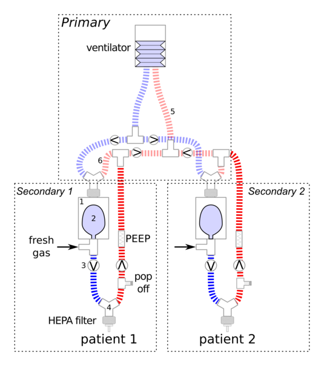

# DISCLAIMER

This is an **INVESTIGATIONAL MEDICAL DEVICE** being evaluated for use
in hospital setting during **extreme crisis** leading to ventilator
shortages.

It has **not been approved** by any regulatory body.

Its use is **not endoresed** by any institution or professional body,
including the ones where it was developed and tested.

We have made every effort to make the system as safe as possible and to
provide documentation and educational materials for its use, should it be
necessary, in order to minimize the very significant risks of iatrogenic harm.

It has significant potential for causing harm  even in the hands of highly
skilled and experienced clinicians. Any clinical application requires close
monitoring of patients by automated system and living, breathing care providers
familiar with the system.

It is posted here in order to faciliate rapid knowledge sharing and research
on strategies for addressing the global ventilator shortage during pandemics.

Any of use of this device is done purely at your own risk and liability. The
developers and associated insititutions do not accept any liability for its use.

**In an ideal world, such a device would never be used on living beings.**

# Cerberus-multivent

One suggested approach to the severe global shortage of ventilators during the current pandemic has been the splitting of ventilators in order to ventilate multiple patients with one device. The simplest version of this involves simply splitting the inspiratory and expiratory limbs of the circuit into a branch for each patient. Indeed a 3D-printable splitter device, the Prisma VEsper, was granted emergency approval by the FDA last week. This approach however poses significant risks and has a high likelihood of harming one or both patients. This motivated a joint statement by all the major critical
care and related societies (<a href="https://www.apsf.org/news-updates/joint-statement-on-multiple-patients-per-ventilator" rel="nofollow">https://www.apsf.org/news-updates/joint-statement-on-multiple-patients-per-ventilator</a>) warning about the hazards of such an approach.

Cerberus, named for the multi-headed dog of Greek mythology, is a ventilator splitting system that allows largely independent ventilation settings for the co-ventilated patients.

The primary ventilator works to drive multiple bellows assemblies, one for each patient. Each patient has a separate fresh gas flows and pressure-isolated secondary circuit.

On inspiration, the inspiratory pressure generated by the ventilator is Y split with one arm per patient. The gas flow from each of these arms drives a bellows assembly (consisting of reservoir bag inside a canister) uniquely connected to the inspiratory limb of each patient circuit. These also include fresh gas inlets for each patient. There is no sharing of inspiratory gas streams. Each patient receives customized fresh gas mix from an unshared source. During expiration the fresh gas flow refills the reservoir bag for the next breath. The expiratory limbs for each patient include an in-line PEEP valve and converge, along with the drive gas outflow from the bellows assemblies into the expiratory limb of the primary circuit. Check valves and filers are placed to pressure isolate all patient circuits and mitigate risk of infections transmission among patients.

# Documentation
Cerberus was originally designed to allow complete assembly using commercial off the shelf (COTS) ventilator circuit components. In addition to this original version, we created two custom components to make the system more robust and allow the adjustment of PEEP for each patient. 

## Bill of Materials & Assembly Instructions:

1. <a href="https://github.com/tgh-apil/Cerberus-Multivent/blob/master/Documentation/Cerberus%20-%20BOM%20and%20Assembly%20Instructions%20-%20Hospital%20COTS%20Components.pdf" rel="nofollow">BOM and Assembly Instructions (COTS version)</a>

2. <a href="https://github.com/tgh-apil/Cerberus-Multivent/blob/master/Documentation/Cerberus%20-%20BOM%20and%20Assembly%20Instructions%20-%20Micromanufactured%20Components.pdf" rel="nofollow">BOM and Assembly Instructions (With customized components)</a>

Custom component design files can be found in the repository.   

## Instructions for Use

1. <a href="https://github.com/tgh-apil/Cerberus-Multivent/blob/master/Documentation/Cerberus%20-%20Safety%20Check%20Lists.pdf" rel="nofollow">Safety Check Lists</a> 

2. <a href="https://github.com/tgh-apil/Cerberus-Multivent/blob/master/Documentation/Cerberus%20-%20Quick%20Guide.pdf" rel="nofollow">Quick Guide</a> 

# Mathematical Model & Simulator

A mathematical model of the system along with a simulator have been created for education staff on managing the system. The simulator also includes a solver that suggest settings to achieve specific end points. All software is in beta. Software is for educational and research use only.

1. <a href="https://github.com/tgh-apil/Cerberus-Multivent/tree/master/Simulator" rel="nofollow">Mathematical Model</a>

2. <a href="https://ventilator-simulator.now.sh/" rel="nofollow">Simulator</a>  

Developed by Eitan Grinspun, Bai Li, Isaac Wallace at the Department of Computer Science, University of Toronto

